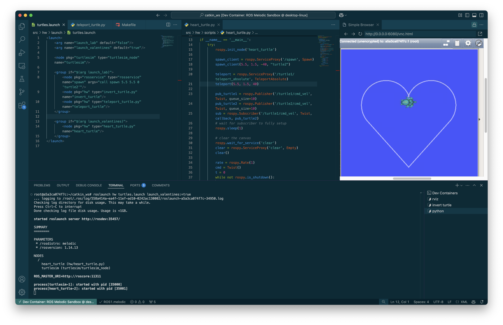
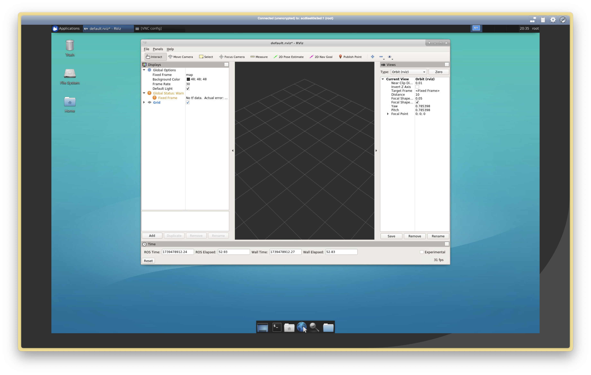

# UoS-ros-setup 🤖
This respository is mostly catered towards **Macs with Apple Sillicon**. For Windows, please refer to the [README.md](./.devcontainer/README.md) file in the `.devcontainer` directory.


## Dev Container Setup
This container is based on `arm64v8/ros:melodic-ros-base-bionic` and uses noVNC for GUI applications, so no X11 server is required. Simply follow the steps below to setup the dev container.

1. Make sure you have docker installed.
    ```bash
    brew install --cask docker
    ```
2. Press `Cmd + Shift + P` and select `Dev Container: Reopen in Container`.

3. Wait for the container to build. When it's finished you should see the message in your terminal:
    ```
    🚀 Container is ready! Connect to the UI by opening: http://localhost:6080/vnc.html in your browser
    ```

4. Click on the link in the terminal to open the noVNC session in your browser. The password for the noVNC session is `password`. Tada! You now have a ROS development environment setup.
