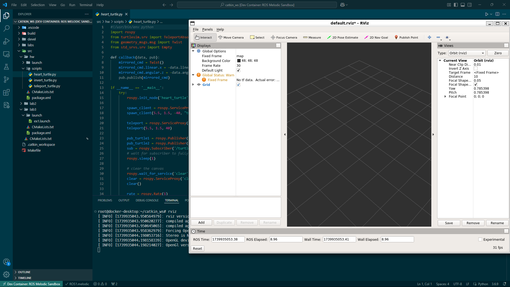

# UoS-ros-setup 🤖
This repository supports both `arm64` 🍎 and `x86_64` 🪟 architectures.


**Read the following information carefully before you proceed!**
- If you have an **Apple Silicon** Mac, the image is based on `arm64v8/ros:melodic-ros-base-bionic` and contains the [noVNC](https://novnc.com/info.html) setup for GUI applications such as `RViz` and `Gazebo`.
- If you have a **PC**, the image is from the University of Surrey's container registry, so make sure you have GlobalProtect VPN installed and connected. See [here](uos_vpn_setup.pdf) for more information. A custom Dockerfile based on `osrf/ros:melodic-desktop-full` is a work in progress 🚧.
- Currently everything is running on integrated graphics. To enable GPU acceleration, you're on your own 🤷‍♂️.

## Directory Layout
```bash
UoS-ros-setup
├── LICENSE
├── README.md
├── assets
│   ├── novnc_gui.png
│   ├── vscode.png
│   ├── x11_preferences.png
│   ├── xeyes.png
│   └── xquartz_login.png
├── catkin_ws
│   ├── Makefile
│   ├── build
│   ├── devel
│   ├── labs
│   └── src
└── uos_vpn_setup.pdf
```

## Dev Container Setup
For both setup, make sure you have [Docker](https://docs.docker.com/get-docker/) installed on your machine. For Mac, you can brew it.
```bash
brew install --cask docker
```
For Windows, use your choice of package manager.
```bash
choco install docker-desktop
```
### Windows Setup 🪟
The Windows setup requires you to have WSL2 installed. Follow the instructions [here](https://docs.microsoft.com/en-us/windows/wsl/install) to install WSL2. Fortunately, unlike the Apple Sillicon setup, [WSLg](https://github.com/microsoft/wslg) takes care of the GUI applications so we don't have to install [noVNC](https://novnc.com/info.html) or [vcXsrv](https://vcxsrv.com/).
1. Connect to `vpn.surrey.ac.uk` using `GlobalProtect VPN`. Run the following command to pull the image from the University of Surrey's container registry and tag it as `uos-ros-setup:latest`.
    ```bash
    docker pull container-registry.surrey.ac.uk/shared-containers/robotics-module-2:latest
    docker tag container-registry.surrey.ac.uk/shared-containers/robotics-module-2:latest uos-robotics:latest
    ```
2. To start the dev container, press `Ctrl + Shift + P` and select `Dev Container: Reopen in Container`.

3. Everything should just work. Try running `RViz` to test the GUI.


### Apple Sillicon Setup 🍎
The Apple Sillicon setup uses `Dockerfile.arm64` and will automatically build once you start the dev container.
1. Same as above. To start the dev container, press `Cmd + Shift + P` and select `Dev Container: Reopen in Container`.
2. Wait for the container to build. When it's finished you should see the message in your terminal:
    ```
    🚀 Container is ready! For 🍎 users, Connect to the UI by opening: http://localhost:6080/vnc.html in your browser
    ```
3. Click on the link in the terminal to open the noVNC session in your browser. The password for the noVNC session is `password`. Tada! You now have a ROS development environment setup.
